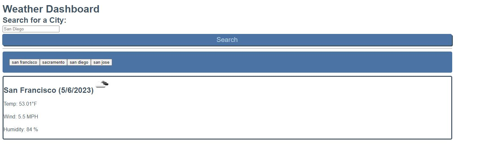

# Weather-Dashboard

## Description

This is a Weather Dashboard application for users who would like to see the 5 day forecast on a city that the user is traveling to. This application leverages the OpenWeather API to pull the weather and forecast information for cities across the US. Previous searches are saved in local storage and users can click back on their search history. 

https://fdirige.github.io/Weather-Dashboard/

## User Story
AS A traveler
I WANT to see the weather outlook for multiple cities
SO THAT I can plan a trip accordingly

## Acceptance Criteria
GIVEN a weather dashboard with form inputs
WHEN I search for a city
THEN I am presented with current and future conditions for that city and that city is added to the search history
WHEN I view current weather conditions for that city
THEN I am presented with the city name, the date, an icon representation of weather conditions, the temperature, the humidity, and the wind speed
WHEN I view future weather conditions for that city
THEN I am presented with a 5-day forecast that displays the date, an icon representation of weather conditions, the temperature, the wind speed, and the humidity
WHEN I click on a city in the search history
THEN I am again presented with current and future conditions for that city

## Screen Shot

